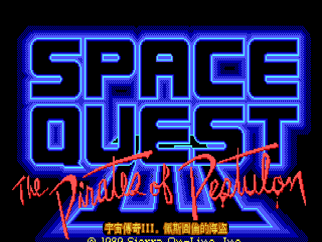
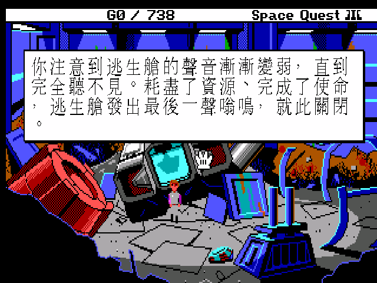

# 宇宙傳奇 III：佩斯圖倫的海盜 — 繁體中文化

> Space Quest III: The Pirates of Pestulon（1989, Sierra On-Line）SCI0 EGA 版
> ScummVM 繁體中文化 · patch-only

**▶ 推廣影片：<https://youtu.be/D82XziOPh0k>**

那個年代，銀河系最不起眼的英雄是一名清潔工。他叫**羅傑·威爾科**，不會用劍、不會魔法，最厲害的本事是拖地——偏偏每次都是他救了全宇宙。三十多年前我們對著英文猜他又闖了什麼禍，這一次，羅傑終於用中文吐槽了。

## 一款會吐槽自己的遊戲

1989 年，Sierra 用 **SCI 引擎**推出《宇宙傳奇 III》，把這個惡搞科幻系列推上高峰。它的幽默是「後設」的——遊戲裡真的出現了現實中設計這款遊戲的兩位作者，**仙女座雙傑**（Scott Murphy 與 Mark Crowe 本人），被一家邪惡的盜版軟體公司**廢渣軟體（ScumSoft）**綁架，逼他們日夜趕工做爛遊戲。而拯救他們的重任，落到了剛用垃圾桶改裝太空船逃出來的清潔工羅傑身上。

配樂也不馬虎：這一集請到 Supertramp 樂團的鼓手 **Bob Siebenberg** 操刀，用 **Roland MT-32** 播放時特別有味道。

本專案把整款遊戲的文字繁體中文化，跑在現代 ScummVM 上，畫面放大到 640×400、中文以 hi-res Big5 字模直繪，筆畫銳利。翻譯走**台式在地化**路線——SQ 系列的笑點本來就靠雙關和吐槽撐著，直譯會冷掉，所以笑話盡量重寫成中文讀者接得住的版本。

## 故事：清潔工的星際逃亡

羅傑·威爾科在冷凍艙裡睡了不知多久，一睜眼，太空船正在解體。他鑽進逃生艙彈射出去，一路墜落到沙漠星球**弗利布特（Phleebhut）**的一座垃圾場。

就在這片破銅爛鐵之間，他撿到半塊晶片，拼湊出一段求救訊息：**仙女座雙傑**——那兩個做出無數經典冒險遊戲的天才設計師——被**廢渣軟體**綁到了衛星要塞**佩斯圖倫（Pestulon）**，關在裡頭沒日沒夜地趕製粗製濫造的遊戲。

從弗利布特的垃圾場出發，羅傑要修好太空船、躲過一台鎖定他的殺手機器人、闖進廢渣軟體的總部，把兩位大師救出來。沿路有巨石漢堡速食店、賣紀念品的奇觀世界、熔岩橫流的歐特加……以及數不清、荒謬到讓人笑出來的死法。

## 畫面

| 中文標題 | 中文開場敘述 |
|---|---|
|  |  |
| 經典藍色 SPACE QUEST logo 完整保留，底部並存中文副標 | 逃生艙墜落弗利布特垃圾場，一段星際歷險就此展開 |

## 特色

- **台式在地化的搞笑翻譯**：雙關、惡搞、流行文化戲仿盡量重寫成中文讀者接得住的梗，笑點優先於字面。星際大戰的 TIE 戰機、《2001 太空漫遊》的 HAL、荒謬的死亡訊息——原本的吐槽感都在。
- **hi-res 銳利中文**：640×400 直繪，遠看近看都清楚，不是把 320×200 硬放大的馬賽克。
- **中文標題**：經典的 SPACE QUEST 藍色霓虹 logo 與紅色手寫副標完整保留，畫面底部並存中文「宇宙傳奇III．佩斯圖倫的海盜」金字副標。
- **統一譯名**：羅傑·威爾科、仙女座雙傑、廢渣軟體、佩斯圖倫、艾爾莫·帕格、鋁製野鴨號、太空幣——全書一致，不漂移。
- **原汁原味的音樂**：Bob Siebenberg 為 MT-32 譜曲，自備 ROM 即可聽到當年的配樂（見下）。
- **新手友善**：這是打字冒險遊戲，用鍵盤輸入英文指令（動詞＋名詞）來玩。**按 `F1` 隨時叫出中文操作說明**，教你怎麼下指令；選單列、狀態列分數也都中文化。
- **完整覆蓋**：主線對白、旁白敘述、parser 回應、道具互動、選單、死亡訊息全中文（狀態列的遊戲品牌名與少數除錯字串保留英文）。

## 安裝與遊玩

需要：
1. 一份《Space Quest III》遊戲檔（含 `RESOURCE.MAP` / `RESOURCE.001`~`003`）。
2. 套用本專案的 ScummVM 引擎 patch（見 [`BUILD.md`](BUILD.md)），或使用完整包（若有提供）。

步驟（簡述，詳見 BUILD.md）：
1. 取乾淨 ScummVM 原始碼（pinned commit 見 `patches/UPSTREAM_COMMIT.txt`），套 `patches/0001-sci-cht-zh_twn.patch` + 複製 `patches/fontchinese.{h,cpp}`，編譯。
2. 把 `dist-cht/` 的 `translation.tsv`、`qfg1_big5.fnt`、`qfg1_big5_hi.fnt`、`sq3_title.ovl` 放進遊戲資料夾。
3. 在 ScummVM 加入遊戲，語言設為 `Chinese (Traditional)`（或 CLI `--language=tw`）啟動。

### Roland MT-32 音樂（建議）

老 Sierra 遊戲為 MT-32 譜曲，音色遠勝 AdLib。自備 MT-32 ROM（`MT32_CONTROL.ROM` + `MT32_PCM.ROM`）放進遊戲資料夾，音效選項選 Roland MT-32 即可。（ROM 有版權，不隨本專案發佈。）

## 中文手冊要點索引

英文遊戲手冊的繁體中文整理見 [`manual_cht/宇宙傳奇III手冊.md`](manual_cht/宇宙傳奇III手冊.md)：

- **背景故事**：羅傑·威爾科的來歷、仙女座雙傑與廢渣軟體的恩怨。
- **操作**：鍵盤打指令（動詞＋名詞，英文輸入）、選單、存讀檔。
- **新手守則**：多觀察、勤存檔、畫地圖，SQ 系列死法多，存檔是保命符。

## 技術文件

- [`BUILD.md`](BUILD.md) — 重建 patched ScummVM
- [`CONTEXT.md`](CONTEXT.md) / [`WORKLIST.md`](WORKLIST.md) — 專案脈絡與里程碑

引擎在複用 SCI0 EGA 中文化基礎（ZH_TWN 啟用、Big5 繪字、hi-res 640×400、kFormat 動態句翻譯、空白正規化 key）上，為 SQ3 把標題疊圖 hook 接到 pic 926，將中文副標以索引點陣直繪 hi-res display buffer。

## 致敬

原作 © 1989 Sierra On-Line。設計 Scott Murphy 與 Mark Crowe（即遊戲裡的「仙女座雙傑」本人），音樂 Bob Siebenberg。本專案為非商業之文化保存與致敬，不含亦不散佈任何遊戲原始資源。
